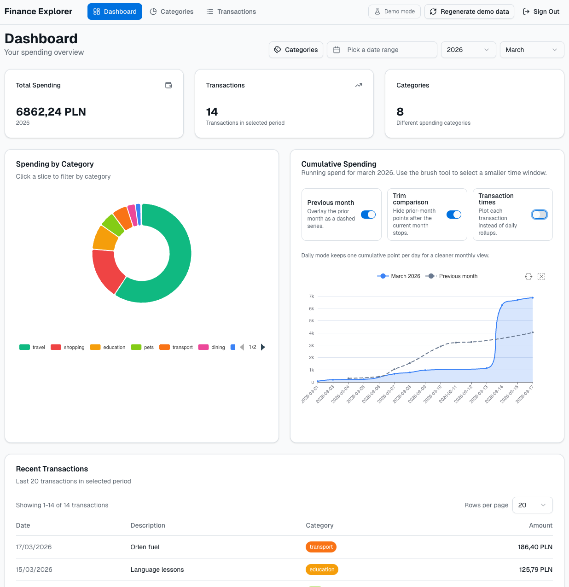
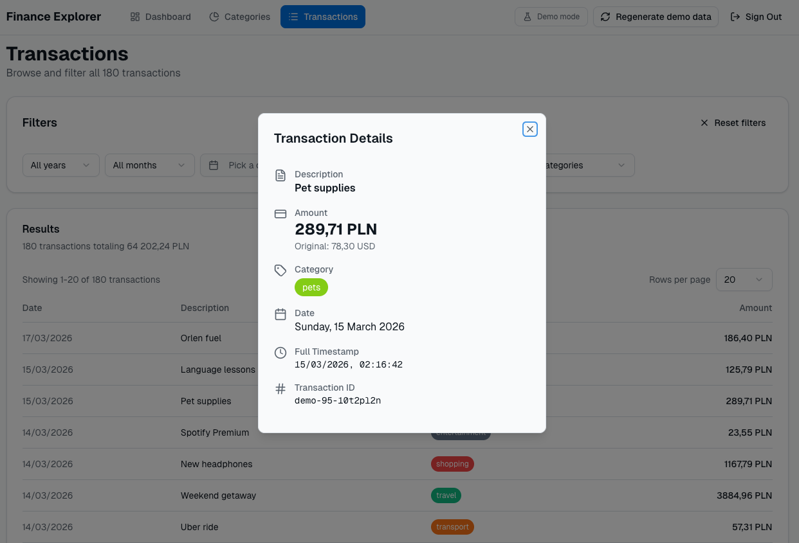
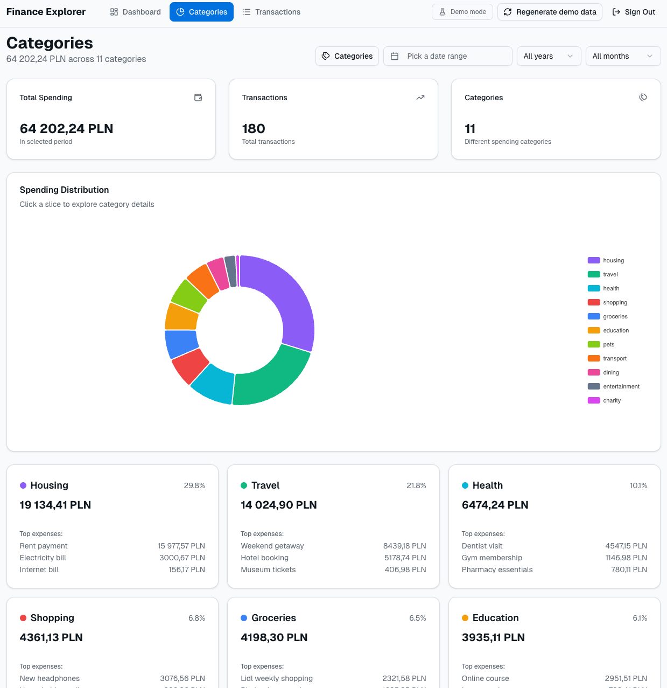
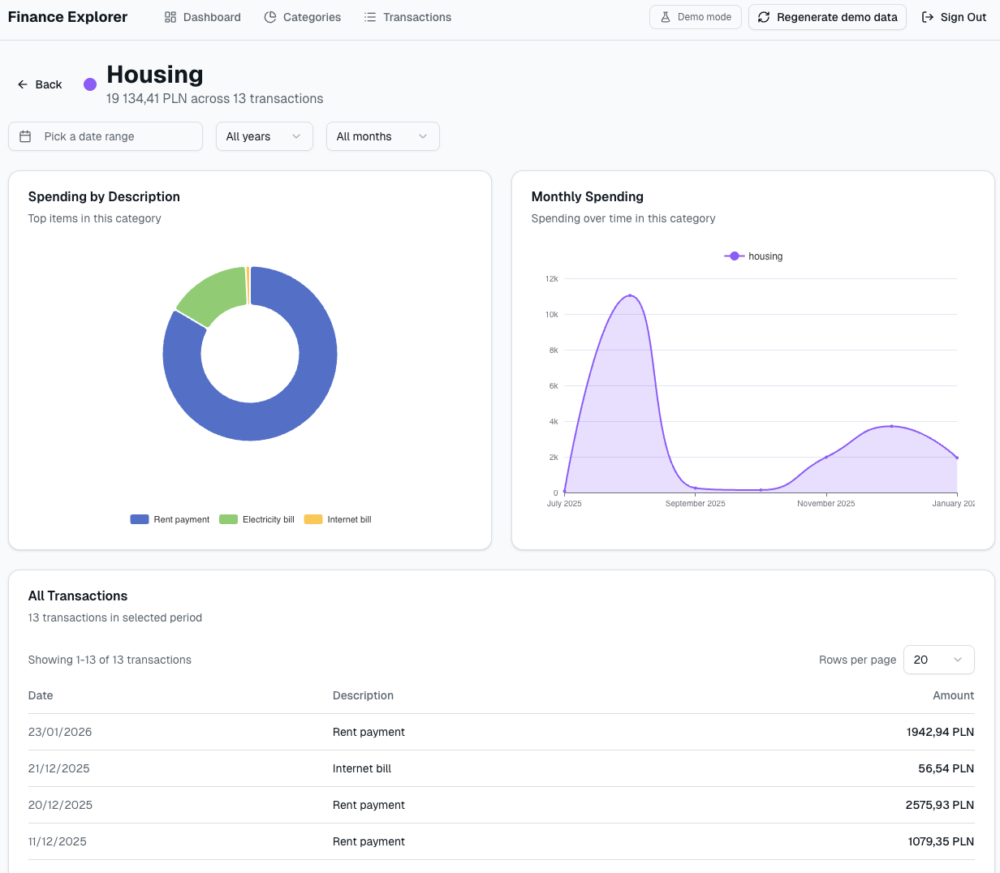

# Personal Finance Explorer

A powerful, privacy-focused personal finance dashboard that turns your Google Sheets into a rich, interactive explorer. Built with Next.js, Google OAuth 2.0, and high-performance charting.

[](https://vercel.com/new/clone?repository-url=https%3A%2F%2Fgithub.com%2Fmaxiwoj%2Fpersonal-finance-explorer-rs&env=NEXT_PUBLIC_GOOGLE_CLIENT_ID,NEXT_PUBLIC_SPREADSHEET_ID,GOOGLE_CLIENT_SECRET,NEXT_PUBLIC_REDIRECT_URI&envDescription=Required%20Google%20OAuth%20credentials%2C%20Spreadsheet%20ID%2C%20and%20Redirect%20URI.%20See%20the%20Authentication%20Guide%20for%20setup%20instructions.&envLink=https%3A%2F%2Fgithub.com%2Fyour-username%2Fpersonal-finance-explorer-rs%2Fblob%2Fmain%2Fdocs%2Fauthentication.md)



## Features

- **Google Sheets Integration**: Directly syncs with your Google Spreadsheet. The app does not store any of your data on its servers.
- **Interactive Dashboard**: Get a high-level overview of your spending, income, and net flow with dynamic charts.
- **Detailed Transaction Explorer**: Search, filter, and drill down into every transaction.
- **Multi-dimensional Filtering**: Filter by date range, month/year, and categories.
- **Privacy First**: Authenticate with Google OAuth and keep your data in your own spreadsheet.

## Screenshots

### Transactions Explorer


### Finance Analysis
#### Categories


#### Category Deep Dive


## Getting Started

### Prerequisites

- Node.js 18.x or later
- A Google Cloud Project with the Google Sheets API enabled
- A Google Spreadsheet with your financial data

### Development

1. **Clone the repository:**
   ```bash
   git clone https://github.com/your-username/personal-finance-explorer-rs.git
   cd personal-finance-explorer-rs
   ```

2. **Install dependencies:**
   ```bash
   pnpm install
   ```

3. **Configure Environment Variables:**
   Create a `.env.local` file in the root directory and add the following:
   ```env
   NEXT_PUBLIC_GOOGLE_CLIENT_ID=your_client_id
   NEXT_PUBLIC_SPREADSHEET_ID=your_spreadsheet_id
   NEXT_PUBLIC_REDIRECT_URI=http://localhost:3000
   GOOGLE_CLIENT_SECRET=your_client_secret
   ```
   *For detailed setup instructions, see the [Authentication Guide](./docs/authentication.md).*

4. **Run the development server:**
   ```bash
   set -a; source .env.local; set +a
   pnpm dev
   ```
   Open [http://localhost:3000](http://localhost:3000) to see the application.

## Documentation

- [Architecture Overview](./docs/architecture.md) - Deep dive into how the app works.
- [Google OAuth Setup](./docs/authentication.md) - Step-by-step guide to setting up Google APIs.
- [Features Explorer](./docs/features.md) - Detailed guide on all available features.
- [Deployment Guide](./docs/deployment.md) - How to deploy your own instance.

## Contributing

Contributions are welcome! Please feel free to submit a Pull Request.
