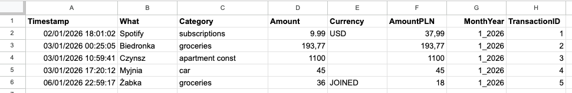

# Setup & Deployment Guide

This guide covers everything from configuring Google Cloud to deploying your own instance of the Personal Finance Explorer on Vercel.

---

## 1. Google Cloud Configuration

### Create Google Cloud Project
1. Go to [Google Cloud Console](https://console.cloud.google.com/).
2. Create a new project (e.g., `finance-explorer`).

### Enable Google Sheets API
1. Go to **APIs & Services > Library**.
2. Search for **Google Sheets API** and click **Enable**.

### Configure OAuth Consent Screen
1. Go to **APIs & Services > OAuth consent screen**.
2. Choose **External** and fill in required fields (app name, email).
3. Add scope: `https://www.googleapis.com/auth/spreadsheets.readonly`.

### Create OAuth Client Credentials
1. Go to **APIs & Services > Credentials**.
2. Click **Create Credentials > OAuth client ID**.
3. Choose **Web application**.
4. **Authorized JavaScript origins**: `http://localhost:3000`.
5. **Authorized redirect URIs**: `http://localhost:3000`.
6. Copy the **Client ID** and **Client Secret**.

---

## 2. Prepare Your Spreadsheet

1. Create a new Google Spreadsheet or use an existing one.
2. Ensure it has a sheet named (by default) `expenses`.
3. The expected column order (starting from A1) is:
    - Timestamp
    - What (description)
    - Category
    - Amount
    - Currency
    - AmountPLN
    - MonthYear
    - TransactionID
4. **Recommendation**: Connect a Google Form with fields "What, Category, Amount, Currency" and infer the rest automatically. Feel free to copy [this spreadsheet](https://docs.google.com/spreadsheets/d/1KTNJ1fwJbM3uFzJzz3Duc2MP88Ybx2OiXrYa51cooKo/edit?usp=sharing) as a template.

5. Copy your **Spreadsheet ID** from the URL:
    `https://docs.google.com/spreadsheets/d/YOUR_SPREADSHEET_ID/edit`

---

## 3. Deploy to Vercel (1-Click)

The fastest way to deploy is using the **Deploy with Vercel** button. This clones the repository to your account and sets up the environment variables.

### Steps:
1. Click the button above.
2. Connect your Git provider.
3. Fill in the environment variables:
    - `NEXT_PUBLIC_GOOGLE_CLIENT_ID`
    - `NEXT_PUBLIC_SPREADSHEET_ID`
    - `NEXT_PUBLIC_REDIRECT_URI` (Use your temporary Vercel URL, e.g., `https://your-app.vercel.app`)
    - `GOOGLE_CLIENT_SECRET`
4. Click **Deploy**.

---

## 4. Finalizing Redirect URIs

Once deployed, you **must** update your Google Cloud Console to allow the production URL:

1. Go to **APIs & Services > Credentials** in Google Cloud Console.
2. Edit your **OAuth 2.0 Client ID**.
3. Add your Vercel deployment URL to:
    - **Authorized JavaScript origins**: e.g., `https://your-app.vercel.app`
    - **Authorized redirect URIs**: e.g., `https://your-app.vercel.app`

---

## ❓ Troubleshooting

- **Invalid Redirect URI**: Ensure the URL in Google Cloud Console matches your Vercel URL exactly (including `https://`).
- **Permission Denied**: Ensure your Google account has at least **Viewer** access to the spreadsheet.
- **Token Expiration**: Verify `GOOGLE_CLIENT_SECRET` is correctly set in Vercel to allow token refreshing.
